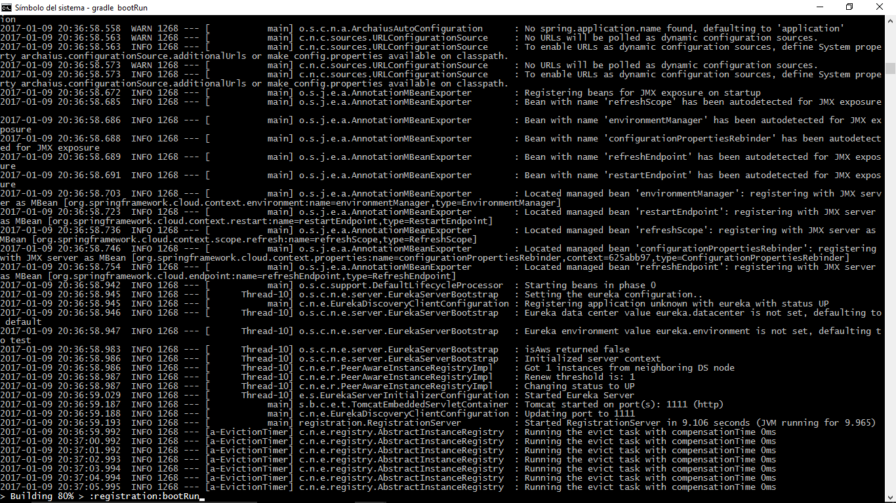
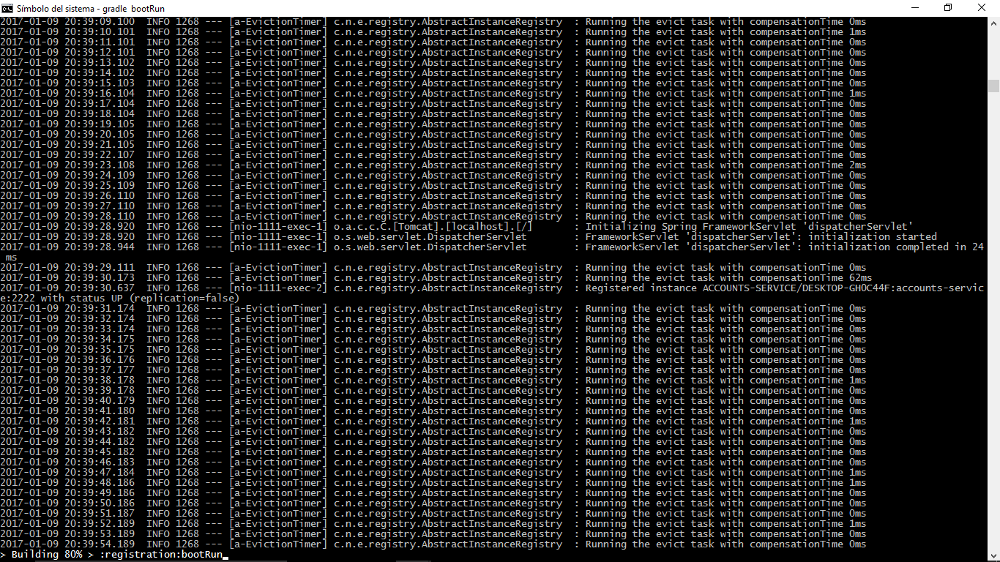
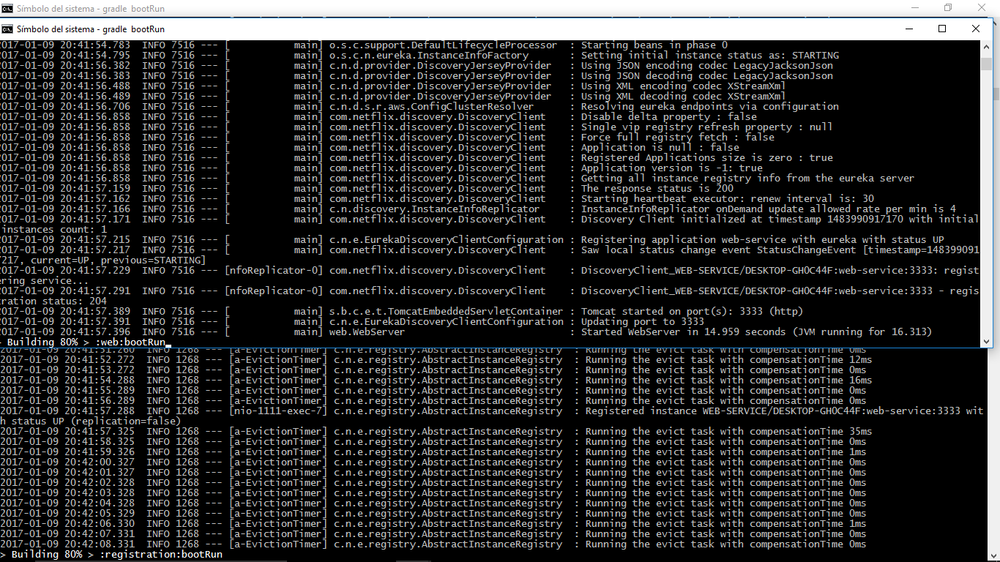
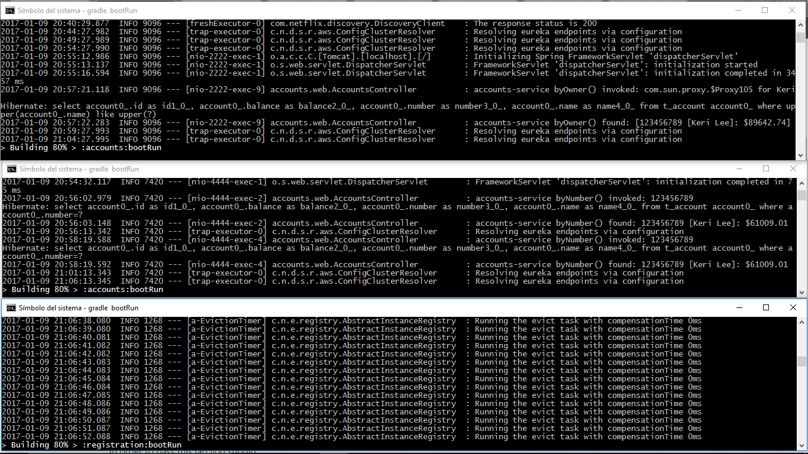
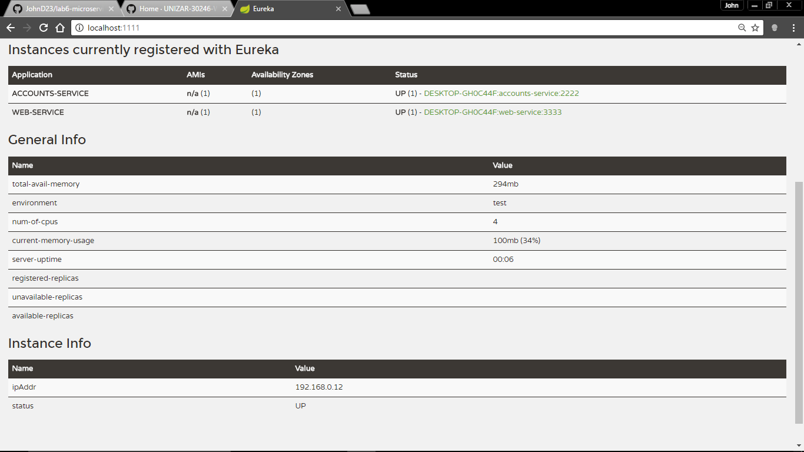
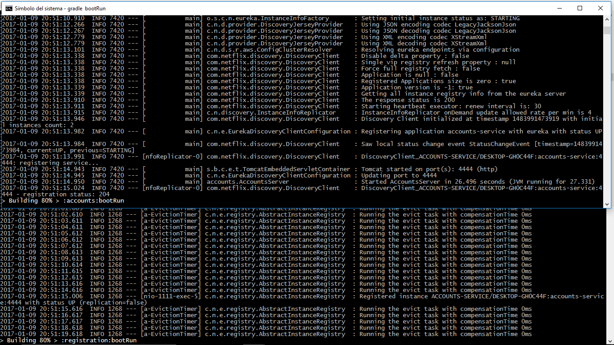
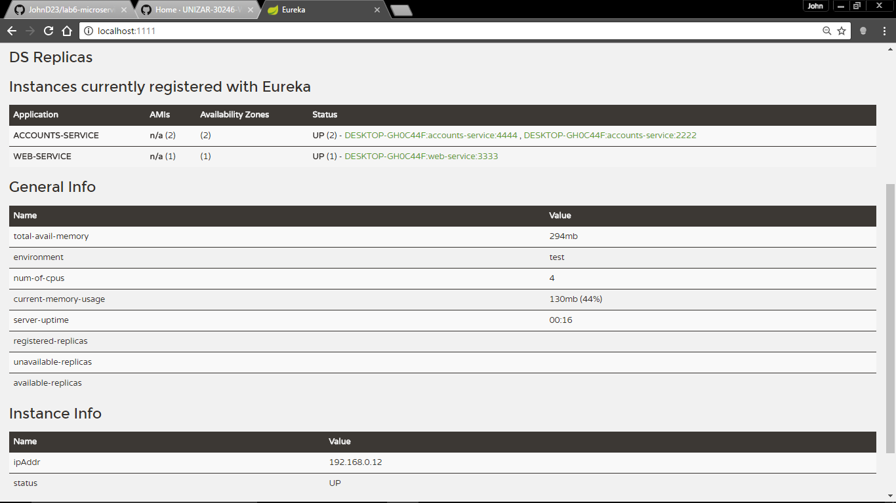

#**Lab Microservices - Web Engineering 2016-2017**

##**Setup**
### Server Eureka is launched

##**The two Microservices are running in the port 2222, 3333 and registered**

##**The service Registration Service Eureka has the two Microservices registered**
### Server Eureka

##**Second Account Microservice is running in the port 4444 and it is registered**
### Service Registration Second Account Microservice

##**The three Microservices are running in the port 2222, 3333, 4444 and registered**
### Server Eureka

##**Brief report and kill the Account Microservice with port 2222**

When kill a Account Microservices on port 2222 the WebService Microservice on port 3333 comunicates with the Registration Service on port 1111 to configure the new endpoint with a Account Microservice available. This is a good sample how an app can continue using data from a server even when it changes location or is broke and the best part isn't need restart the app and which provides a greater benefit for both users and service providers.